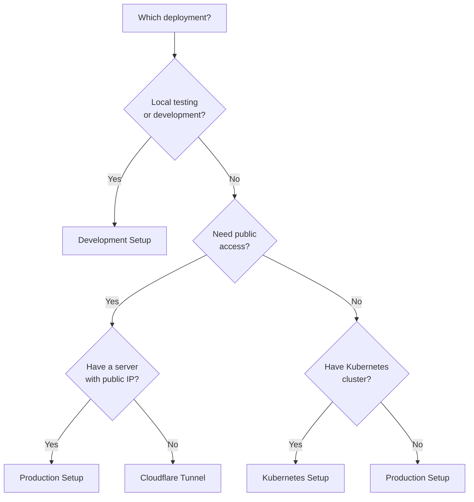

# RCC Remote Docker - Complete Setup Guide

> **One guide to rule them all** - Everything you need to deploy RCC Remote in any environment.

## Table of Contents

- [Which Deployment Should I Choose?](#which-deployment-should-i-choose)
- [Prerequisites](#prerequisites)
- [Development Setup](#development-setup)
- [Production Setup](#production-setup)
- [Cloudflare Tunnel Setup](#cloudflare-tunnel-setup)
- [Kubernetes Setup](#kubernetes-setup)
- [Client Configuration](#client-configuration)
- [Testing Your Deployment](#testing-your-deployment)
- [Next Steps](#next-steps)

---

## Which Deployment Should I Choose?



**Quick Decision:**
- 🏠 **Testing locally?** → [Development Setup](#development-setup)
- 🌍 **Need public access without a server?** → [Cloudflare Tunnel](#cloudflare-tunnel-setup)
- 🏢 **Have a server with public IP?** → [Production Setup](#production-setup)
- ☸️ **Have Kubernetes?** → [Kubernetes Setup](#kubernetes-setup)

---

## Prerequisites

### All Deployments Need
- Linux host (Ubuntu 20.04+, Fedora, or Universal Blue)
- Docker 20.10+ and Docker Compose
- 8GB RAM minimum
- 50GB+ storage

### Check Your System
```bash
make env-check
```

This will verify you have:
- ✅ Docker
- ✅ Docker Compose
- ✅ OpenSSL
- ⚠️ kubectl (only for Kubernetes)
- ⚠️ RCC client (optional, for testing)

### Install RCC Client (Optional)
```bash
# Linux
wget https://downloads.robocorp.com/rcc/releases/latest/linux64/rcc
chmod +x rcc
sudo mv rcc /usr/local/bin/

# macOS
brew install robocorp/tools/rcc

# Verify
rcc --version
```

---

## Development Setup

**Best for:** Local testing, development, learning

**Access:** `https://localhost:8443` (self-signed certificate)

### Step-by-Step

#### 1. Start Development Environment

```bash
make quick-dev
```

This single command:
- ✅ Generates self-signed SSL certificates
- ✅ Creates required directories
- ✅ Builds Docker images
- ✅ Starts services on port 8443
- ✅ Imports sample robot catalogs

#### 2. Verify Services

```bash
# Check running containers
make ps

# View logs
make dev-logs

# Health check
make test-health
```

#### 3. Configure RCC Client

```bash
# Configure RCC to use the server   
make client-configure

# Set environment variable (this session only)
export RCC_REMOTE_ORIGIN=https://localhost:8443

# Or add to your shell config for persistence
echo 'export RCC_REMOTE_ORIGIN=https://localhost:8443' >> ~/.zshrc
source ~/.zshrc
```

#### 4. Test Connection

```bash
# List available catalogs
rcc holotree catalogs

# Test with a robot
cd data/robots/rf7
rcc holotree vars
```

### Common Development Tasks

```bash
# Stop services
make dev-down

# Restart services
make dev-restart

# View logs
make dev-logs

# Shell into container
make dev-shell-rccremote

# Clean everything
make dev-clean
```

---

## Production Setup

**Best for:** Private servers with public IP, internal networks

**Access:** `https://your-domain.com` (custom domain)

**Important:** Requires proper SSL certificates for security!

### Step-by-Step

#### 1. Generate Production Certificates

```bash
# Generate CA-signed certificates
make certs-signed SERVER_NAME=your-domain.com
```

This creates:
- `certs/rootCA.crt` - Root CA (install on clients)
- `certs/server.crt` - Server certificate
- `certs/server.key` - Server private key

#### 2. Install Root CA on Client Machines

**Linux:**
```bash
sudo cp certs/rootCA.crt /usr/local/share/ca-certificates/rccremote-ca.crt
sudo update-ca-certificates
```

**macOS:**
```bash
sudo security add-trusted-cert -d -r trustRoot \
  -k /Library/Keychains/System.keychain certs/rootCA.crt
```

**Windows (PowerShell as Admin):**
```powershell
certutil -addstore -f "ROOT" certs\rootCA.crt
```

#### 3. Start Production Environment

```bash
make prod-up SERVER_NAME=your-domain.com
```

This command:
- ✅ Validates certificates exist
- ✅ Starts services on port 443 (standard HTTPS)
- ✅ Configures nginx with your domain name
- ✅ Imports robot catalogs

#### 4. Configure DNS

Point your domain to your server's IP:

```
A Record: your-domain.com → 203.0.113.42
```

Or for internal networks, update `/etc/hosts` on client machines:

```bash
echo "192.168.1.100 your-domain.com" | sudo tee -a /etc/hosts
```

#### 5. Configure RCC Clients

```bash
# On each client machine
make client-configure

# Set environment variable
export RCC_REMOTE_ORIGIN=https://your-domain.com
echo 'export RCC_REMOTE_ORIGIN=https://your-domain.com' >> ~/.zshrc
```

#### 6. Test Connection

```bash
# From client machine
rcc holotree catalogs
```

### Common Production Tasks

```bash
# View status
make ps

# View logs
make prod-logs

# Restart services
make prod-restart

# Stop services
make prod-down
```

### Using Your Own SSL Certificates

If you already have SSL certificates from Let's Encrypt or another CA:

```bash
# Place your certificates
cp /path/to/your/cert.pem certs/server.crt
cp /path/to/your/key.pem certs/server.key
cp /path/to/your/ca.pem certs/rootCA.crt  # Optional

# Start production
make prod-up SERVER_NAME=your-domain.com
```

---

## Cloudflare Tunnel Setup

**Best for:** Public access without a server, no port forwarding, automatic SSL

**Access:** `https://rccremote.yourdomain.com` (trusted SSL via Cloudflare)

**Why Cloudflare Tunnel?**
- ✅ No public IP needed
- ✅ No port forwarding
- ✅ No certificate management (Cloudflare handles it)
- ✅ Free SSL from a trusted CA
- ✅ Access from anywhere
- ✅ Built-in DDoS protection

### Prerequisites

- Domain managed by Cloudflare (free account works)
- `cloudflared` CLI installed

### Step-by-Step

#### 1. Install cloudflared

**Universal Blue / Bluefin (Homebrew):**
```bash
brew install cloudflare/cloudflare/cloudflared
```

**Ubuntu/Debian:**
```bash
wget https://github.com/cloudflare/cloudflared/releases/latest/download/cloudflared-linux-amd64.deb
sudo dpkg -i cloudflared-linux-amd64.deb
```

**Fedora:**
```bash
wget https://github.com/cloudflare/cloudflared/releases/latest/download/cloudflared-linux-amd64.rpm
sudo rpm -i cloudflared-linux-amd64.rpm
```

**Verify:**
```bash
cloudflared --version
```

#### 2. Create and Deploy Tunnel (One Command!)

```bash
make quick-cf HOSTNAME=rccremote.yourdomain.com
```

This single command:
- ✅ Authenticates with Cloudflare (opens browser)
- ✅ Creates a tunnel named "rccremote"
- ✅ Configures DNS (CNAME record)
- ✅ Saves tunnel token to `.env`
- ✅ Starts Docker containers
- ✅ Connects tunnel to your service

**What you'll see:**
1. Browser opens for Cloudflare authentication
2. Script creates tunnel and configures DNS
3. Docker containers start
4. Tunnel connects (check logs with `make cf-logs`)

#### 3. Configure RCC Clients

**No SSL profile needed!** Cloudflare provides trusted SSL certificates.

```bash
# Just set the origin
export RCC_REMOTE_ORIGIN=https://rccremote.yourdomain.com
echo 'export RCC_REMOTE_ORIGIN=https://rccremote.yourdomain.com' >> ~/.zshrc
```

#### 4. Test Connection

```bash
# From anywhere in the world
rcc holotree catalogs
```

### Common Cloudflare Tasks

```bash
# View tunnel status
make cf-tunnel-list

# View logs
make cf-logs

# Stop tunnel
make cf-down

# Restart tunnel
make cf-restart

# Delete tunnel
make cf-tunnel-delete TUNNEL_NAME=rccremote
```

### Multiple Environments

```bash
# Development tunnel
make cf-create HOSTNAME=rccremote-dev.yourdomain.com TUNNEL_NAME=rcc-dev AUTO_DEPLOY=true

# Production tunnel
make cf-create HOSTNAME=rccremote.yourdomain.com TUNNEL_NAME=rcc-prod AUTO_DEPLOY=true
```

### Troubleshooting Cloudflare

**Browser didn't open?**
```bash
cloudflared tunnel login
```

**Tunnel name already exists?**
```bash
# List existing tunnels
make cf-tunnel-list

# Use existing or delete old one
make cf-tunnel-delete TUNNEL_NAME=rccremote
```

**Can't connect?**
```bash
# Check tunnel status
cloudflared tunnel info rccremote

# View logs
make cf-logs
```

---

## Kubernetes Setup

**Best for:** Enterprise deployments, high availability, 100+ clients

**Features:**
- Horizontal scaling (auto-scale based on load)
- High availability (99.9% uptime)
- Load balancing
- Health checks
- Prometheus metrics

### Prerequisites

- Kubernetes cluster 1.20+
- kubectl configured
- 3+ worker nodes recommended
- Storage provisioner (or local storage)

### Step-by-Step

#### 1. Deploy to Kubernetes

```bash
make quick-k8s
```

This command:
- ✅ Builds Docker images
- ✅ Creates namespace
- ✅ Applies all manifests
- ✅ Configures health checks
- ✅ Sets up auto-scaling (HPA)

Or with custom settings:

```bash
make k8s-deploy NAMESPACE=rccremote REPLICAS=3
```

#### 2. Verify Deployment

```bash
# Check pods
make k8s-status

# View logs
make k8s-logs

# Check events
make k8s-events
```

#### 3. Get Service URL

```bash
# Get service details
kubectl get svc -n rccremote

# For LoadBalancer
kubectl get svc rccremote -n rccremote -o jsonpath='{.status.loadBalancer.ingress[0].ip}'

# For NodePort
kubectl get svc rccremote -n rccremote -o jsonpath='{.spec.ports[0].nodePort}'
```

#### 4. Configure RCC Clients

```bash
# Use LoadBalancer IP or Ingress hostname
export RCC_REMOTE_ORIGIN=https://your-k8s-service.com
```

### Common Kubernetes Tasks

```bash
# Scale manually
kubectl scale deployment rccremote -n rccremote --replicas=5

# Restart deployment
make k8s-restart

# View detailed status
make k8s-describe

# Shell into pod
make k8s-shell

# Port forward for testing
make k8s-port-forward
# Access at https://localhost:8443
```

### Monitoring

```bash
# Watch pods in real-time
watch kubectl get pods -n rccremote

# Check resource usage
kubectl top pods -n rccremote

# View HPA status
kubectl get hpa -n rccremote
```

### Uninstall

```bash
make k8s-uninstall
```

---

## Client Configuration

### Why Configure Clients?

RCC needs to know:
1. Where to find the remote server (`RCC_REMOTE_ORIGIN`)
2. How to verify SSL certificates (via profile)

### Automatic Configuration

```bash
make client-configure
```

This script:
- ✅ Detects certificate setup
- ✅ Creates appropriate RCC profile
- ✅ Configures SSL verification
- ✅ Tests connection

### Manual Configuration

#### Option 1: With CA Certificate (Recommended)

```bash
# Create profile with CA bundle
rcc config profile ssl-cabundle <<EOF
name: ssl-cabundle
description: SSL with CA bundle verification
settings:
  verify-ssl: true
  ca-bundle: |
$(cat certs/rootCA.crt | sed 's/^/    /')
EOF

# Switch to profile
rcc config switch ssl-cabundle
```

#### Option 2: Without SSL Verification (Development Only)

```bash
# Create no-verify profile
rcc config profile ssl-noverify <<EOF
name: ssl-noverify
description: Disable SSL verification
settings:
  verify-ssl: false
EOF

# Switch to profile
rcc config switch ssl-noverify
```

### Set Remote Origin

```bash
# Development
export RCC_REMOTE_ORIGIN=https://localhost:8443

# Production
export RCC_REMOTE_ORIGIN=https://your-domain.com

# Cloudflare
export RCC_REMOTE_ORIGIN=https://rccremote.yourdomain.com

# Make persistent
echo 'export RCC_REMOTE_ORIGIN=https://your-server' >> ~/.zshrc
source ~/.zshrc
```

### Verify Configuration

```bash
# Check active profile
rcc config switch

# Check remote origin
echo $RCC_REMOTE_ORIGIN

# Test connection
rcc holotree catalogs
```

---

## Testing Your Deployment

### Quick Health Check

```bash
make test-health
```

### Comprehensive Tests

```bash
# Test Docker deployment
make test-docker

# Test Kubernetes deployment
make test-k8s

# Test RCC connectivity
make test-rcc

# Run all tests
make test-all
```

### Manual Testing

#### 1. Test HTTPS Endpoint

```bash
# Development
curl -k https://localhost:8443/

# Production (with CA)
curl --cacert certs/rootCA.crt https://your-domain.com/

# Cloudflare
curl https://rccremote.yourdomain.com/
```

#### 2. Test RCC Client

```bash
# List available catalogs
rcc holotree catalogs

# Test with a sample robot
cd data/robots/rf7
rcc holotree vars

# Check space was created
rcc holotree list
```

#### 3. View Logs

```bash
# Docker
make logs

# Kubernetes
make k8s-logs
```

---

## Next Steps

### Add Your Own Robots

1. **Create robot directory:**
   ```bash
   mkdir -p data/robots/my-robot
   cd data/robots/my-robot
   ```

2. **Create `robot.yaml`:**
   ```yaml
   tasks:
     run:
       command:
         - python
         - -c
         - print('Hello from RCC Remote!')
   
   condaConfigFile: conda.yaml
   ```

3. **Create `conda.yaml`:**
   ```yaml
   channels:
     - conda-forge
   dependencies:
     - python=3.10
     - pip
   ```

4. **Restart service to build catalog:**
   ```bash
   # Docker
   make dev-restart  # or make prod-restart
   
   # Kubernetes
   make k8s-restart
   ```

5. **Test from client:**
   ```bash
   cd /path/to/my-robot
   rcc holotree vars
   ```

### Import Pre-built Catalogs

1. **Export catalog from build machine:**
   ```bash
   cd /path/to/robot
   rcc holotree export -r robot.yaml -z my-robot.zip
   ```

2. **Copy to server:**
   ```bash
   cp my-robot.zip /path/to/rccremote-docker/data/hololib_zip/
   ```

3. **Restart service:**
   ```bash
   make dev-restart  # or prod-restart
   ```

### Monitor Performance

```bash
# Docker stats
docker stats rccremote-dev

# Kubernetes metrics
kubectl top pods -n rccremote

# View Prometheus metrics (if enabled)
kubectl port-forward -n rccremote svc/rccremote 8080:8080
curl http://localhost:8080/metrics
```

### Scale for More Clients

**Kubernetes (Automatic):**
```yaml
# HPA already configured in k8s/deployment.yaml
# Auto-scales from 3 to 10 replicas based on CPU
```

**Docker (Manual):**
```bash
# Run multiple instances behind a load balancer
docker compose -f docker-compose/docker-compose.production.yml up -d --scale rccremote=3
```

### Backup Robot Data

```bash
# Create backup
make backup

# Restore from backup
make restore BACKUP_FILE=backups/robots-20240115-120000.tar.gz
```

### Upgrade RCC/RCCRemote Versions

Edit `Dockerfile-rcc` and update versions:

```dockerfile
ENV RCC_VERSION=17.28.4
ENV RCCREMOTE_VERSION=17.18.0
```

Then rebuild:

```bash
make build
make dev-restart  # or prod-restart
```

---

## Need Help?

- **Troubleshooting:** See [docs/troubleshooting.md](troubleshooting.md)
- **Architecture:** See [docs/ARCHITECTURE.md](ARCHITECTURE.md)
- **Issues:** [GitHub Issues](https://github.com/yorko-io/rccremote-docker/issues)

---

## Quick Reference

### Essential Commands

| Task | Command |
|------|---------|
| **Development** |
| Start dev environment | `make quick-dev` |
| View logs | `make dev-logs` |
| Stop dev | `make dev-down` |
| **Production** |
| Generate certificates | `make certs-signed SERVER_NAME=your-domain.com` |
| Start production | `make prod-up SERVER_NAME=your-domain.com` |
| View logs | `make prod-logs` |
| Stop production | `make prod-down` |
| **Cloudflare** |
| Setup tunnel | `make quick-cf HOSTNAME=rccremote.yourdomain.com` |
| View logs | `make cf-logs` |
| Stop tunnel | `make cf-down` |
| **Kubernetes** |
| Deploy | `make quick-k8s` |
| View status | `make k8s-status` |
| View logs | `make k8s-logs` |
| Scale | `kubectl scale deployment rccremote -n rccremote --replicas=5` |
| **Client** |
| Configure client | `make client-configure` |
| Test connection | `rcc holotree catalogs` |
| **Maintenance** |
| Health check | `make test-health` |
| View all containers | `make ps` |
| Backup data | `make backup` |

### Environment Variables

```bash
# Development
export RCC_REMOTE_ORIGIN=https://localhost:8443

# Production
export RCC_REMOTE_ORIGIN=https://your-domain.com

# Cloudflare
export RCC_REMOTE_ORIGIN=https://rccremote.yourdomain.com
```

Add to `~/.zshrc` or `~/.bashrc` for persistence.
